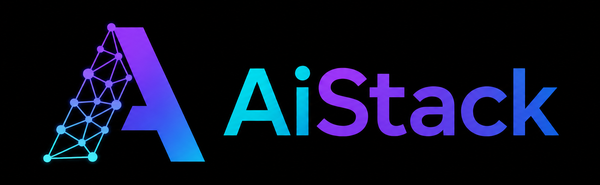

<p align="center">
    
</p>
<br>

<p align="center">
    <a href="https://docs.aistack.ai" target="_blank">
        </a>
    <a href="./LICENSE" target="_blank">
        </a>
    <a href="https://discord.gg/your-invite-link" target="_blank">
        </a>
</p>
<br>

<p align="center">
  <a href="./README.md">English</a> |
  <a href="./README_CN.md">简体中文</a>
</p>

<br>

## 概述

AiStack 是一款开源的 AI 推理集群管理平台，面向企业私有化 AI 推理集群运维场景。它能够配置和编排多种推理引擎（vLLM、SGLang、TensorRT-LLM 或自定义引擎），并支持按需启动可通过 SSH 访问的 GPU 实例。其核心能力包括：

- **多集群 GPU 统一管理。** 跨多个环境统一管理 GPU 集群，覆盖本地物理服务器、Kubernetes 集群以及云端资源，打通异构基础设施。
- **可插拔推理引擎。** 自动配置 vLLM、SGLang、TensorRT-LLM 等高性能推理引擎，同时支持自定义引擎接入，灵活适配各类业务需求。
- **Day 0 模型即时部署。** 得益于可插拔的引擎架构，新模型发布当天即可完成部署上线，无需等待平台版本更新。
- **开箱即用的性能调优。** 提供面向低延迟与高吞吐的预调优模式。支持 LMCache、HiCache 等扩展 KV 缓存系统以降低首字响应时间（TTFT），内置 EAGLE3、MTP、N-grams 等推测解码方法。
- **GPU 实例按需供给。** 按需启动可 SSH 访问的 GPU 实例，满足开发调试、模型微调和交互式任务负载需求。
- **企业级运维保障。** 提供自动故障恢复、负载均衡、实时监控、身份认证与访问控制等企业级运维能力，保障生产环境稳定运行。

## 架构

AiStack 帮助开发团队、IT 部门和服务提供商大规模交付"模型即服务"（Model-as-a-Service）。平台支持 LLM、语音、图像、视频等模型的行业标准 API，内置用户认证与访问控制、GPU 性能与利用率实时监控，以及 Token 用量与 API 调用量的精细化计量。

单台 AiStack Server 可统一管理跨本地和云端的多个 GPU 集群。AiStack 调度器智能分配 GPU 资源以最大化利用率，并为不同模型自动选择最优推理引擎。管理员可通过集成的 Grafana 和 Prometheus 仪表板全面掌握系统健康状态和运行指标。

## 推理性能优化

AiStack 的自动化引擎选择与参数调优机制，可开箱即用地提供卓越的推理性能。系统针对每种模型与硬件组合自动优化配置，相比推理引擎默认设置可获得显著的吞吐量提升。

## 支持的加速器

AiStack 具备广泛的 GPU 硬件兼容性，可兼容环境内已部署的各类主流 GPU，充分复用现有硬件资源。支持的加速器类型包括：

- **NVIDIA GPU**
- **AMD GPU**
- **Ascend NPU（华为昇腾）**
- **Hygon DCU（海光）**
- **MThreads GPU（摩尔线程）**
- **Iluvatar GPU（天数智芯）**
- **MetaX GPU（沐曦）**
- **Cambricon MLU（寒武纪）**
- **T-Head PPU（平头哥）**

有关详细的环境要求和安装配置说明，请参阅[安装要求](https://docs.aistack.ai/latest/installation/requirements/)文档。

## 快速入门

### 前提条件

1. 一个至少配备一块 NVIDIA GPU 的节点。如需使用其他类型 GPU，请在 AiStack 管理界面添加 Worker 时查看操作指引，或参阅[安装文档](https://docs.aistack.ai/latest/installation/requirements/)获取详细信息。
2. 确保 Worker 节点上已安装 NVIDIA 驱动程序、[Docker](https://docs.docker.com/engine/install/) 以及 [NVIDIA Container Toolkit](https://docs.nvidia.com/datacenter/cloud-native/container-toolkit/install-guide.html)。
3. （可选）一台用于部署 AiStack Server 的 CPU 节点。AiStack Server 无需 GPU，可运行在纯 CPU 机器上。需安装 [Docker](https://docs.docker.com/engine/install/)，同时支持 Docker Desktop（Windows 和 macOS）。如无专用 CPU 节点，也可将 AiStack Server 与 GPU Worker 部署在同一台机器上。
4. AiStack Worker 节点仅支持 Linux 操作系统。Windows 用户请考虑使用 WSL2 并避免使用 Docker Desktop。macOS 不支持作为 AiStack Worker 节点。

### 安装 AiStack

运行以下命令，使用 Docker 安装并启动 AiStack Server：

```bash
sudo docker run -d --name aistack \
    --restart unless-stopped \
    -p 80:80 \
    --volume aistack-data:/var/lib/aistack \
    aistack/aistack
```

查看 AiStack 启动日志：

```bash
sudo docker logs -f aistack
```

AiStack 启动完成后，运行以下命令获取默认管理员密码：

```bash
sudo docker exec aistack cat /var/lib/aistack/initial_admin_password
```

打开浏览器，访问 `http://你的主机IP` 进入 AiStack 管理界面。使用默认用户名 `admin` 和上面获取的密码登录。

### 设置 GPU 集群

1. 在 AiStack 管理界面中，导航至 `集群` 页面。
2. 点击 `添加集群` 按钮。
3. 选择 `Docker` 作为集群提供商。
4. 填写新集群的 `名称` 和 `描述`，然后点击 `保存`。
5. 按照界面指引配置 Worker 节点。需要在 Worker 节点上执行以下 Docker 命令以连接至 AiStack Server：

    ```bash
    sudo docker run -d --name aistack-worker \
          --restart=unless-stopped \
          --privileged \
          --network=host \
          --volume /var/run/docker.sock:/var/run/docker.sock \
          --volume aistack-data:/var/lib/aistack \
          --runtime nvidia \
          aistack/aistack \
          --server-url http://你的_aistack_server_地址 \
          --token 你的_worker_token \
          --advertise-address 192.168.1.2
    ```

6. 在 Worker 节点上执行上述命令完成接入。
7. 接入成功后，Worker 节点将出现在 AiStack 管理界面的 `Workers` 页面中。

### 部署模型

1. 在 AiStack 管理界面中导航至 `模型目录（Catalog）` 页面。
2. 从可用模型列表中选择所需模型（例如 `Qwen3.5-0.8B`）。
3. 部署兼容性检查通过后，点击 `保存` 按钮开始部署。
4. AiStack 将自动下载模型文件并完成部署。当部署状态显示为 `Running` 时，表示模型已成功运行。
5. 点击导航菜单中的 `Playground - Chat`，即可在可视化界面中与已部署模型进行对话测试。

### 通过 API 使用模型

1. 导航至 `访问控制` > `API Keys` 页面，点击 `新建 API Key` 按钮。
2. 填写名称并点击 `保存`。
3. 复制生成的 API 密钥并妥善保管（创建后仅可见一次）。
4. 使用该 API 密钥访问 AiStack 提供的 OpenAI 兼容 API 端点。示例如下：

```bash
# 将 `your_api_key` 和 `your_aistack_server_url`
# 替换为实际的 API 密钥和 AiStack 服务器地址
export AISTACK_API_KEY=your_api_key
curl http://your_aistack_server_url/v1/chat/completions \
  -H "Content-Type: application/json" \
  -H "Authorization: Bearer $AISTACK_API_KEY" \
  -d '{
    "model": "qwen3.5-0.8b",
    "messages": [
      {
        "role": "system",
        "content": "You are a helpful assistant."
      },
      {
        "role": "user",
        "content": "告诉我一个笑话。"
      }
    ],
    "stream": true
  }'
```

## 文档

请访问 [AiStack 官方文档](https://docs.aistack.ai) 获取完整使用文档。

## 构建

1. 安装 [Docker](https://docs.docker.com/engine/install/)。
2. 运行 `make package`。

## 贡献

如果您有兴趣参与 AiStack 的开发，请阅读 [贡献指南](./docs/contributing.md)。

## 许可证

版权所有 (c) 2024-2026 AiStack 作者

本项目基于 Apache License, Version 2.0 授权。
详见 [LICENSE](./LICENSE) 文件。

除非适用法律要求或书面同意，根据许可证分发的软件按"原样"分发，无任何明示或暗示的担保或条件。
请参阅许可证中规定的权限与限制。
