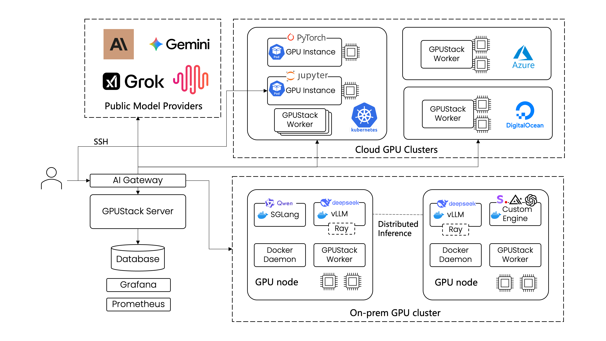
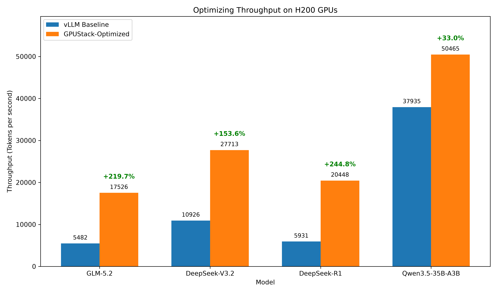
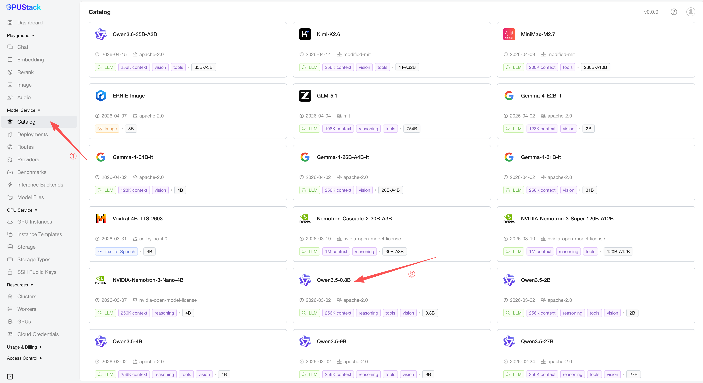
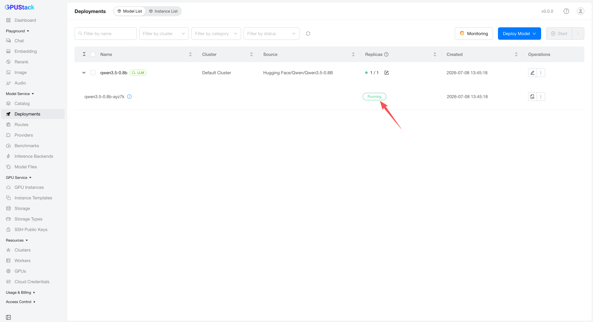
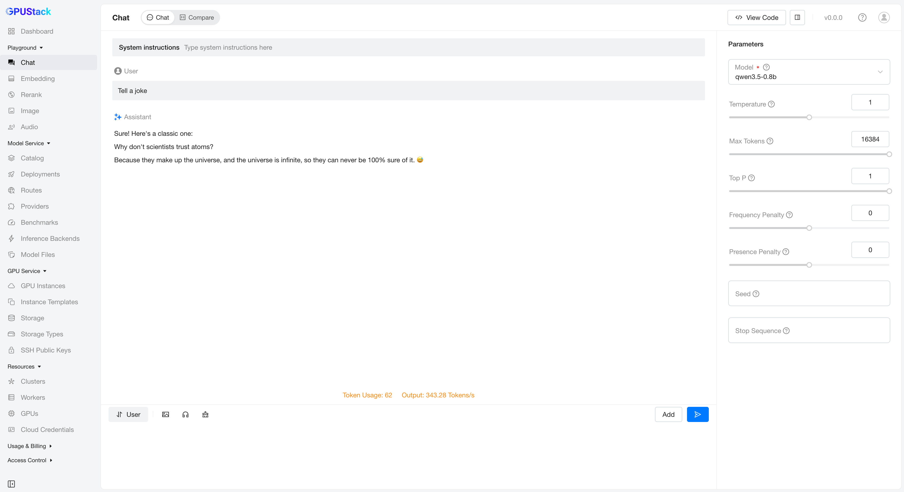

<br>

<p align="center">
    
</p>
<br>

<p align="center">
    <a href="https://docs.aistack.ai" target="_blank">
        </a>
    <a href="./LICENSE" target="_blank">
        </a>
    <a href="https://discord.gg/VXYJzuaqwD" target="_blank">
        </a>
    <a href="https://twitter.com/intent/follow?screen_name=aistack_ai" target="_blank">
        </a>
</p>
<br>

<p align="center">
  <a href="./README.md">English</a> |
  <a href="./README_CN.md">简体中文</a> |
  <a href="./README_JP.md">日本語</a>
</p>

<br>

## 概要

AiStackは、AIモデルサービングとGPUインスタンスプロビジョニングのためのオープンソースのGPUクラスタマネージャーです。推論エンジン（vLLM、SGLang、TensorRT-LLM、またはカスタムエンジン）を構成・オーケストレーションし、オンデマンドでSSHアクセス可能なGPUインスタンスを起動できます。主な機能は以下の通りです：
- **マルチクラスタGPU管理。** 複数の環境にわたるGPUクラスタを管理します。これには、オンプレミスサーバー、Kubernetesクラスタ、およびクラウドプロバイダが含まれます。
- **プラグ可能な推論エンジン。** vLLM、SGLang、TensorRT-LLMなどの高性能推論エンジンを自動的に設定します。必要に応じてカスタム推論エンジンを追加することもできます。
- **Day 0モデルサポート。** AiStackのプラグ可能なエンジンアーキテクチャにより、新しいモデルがリリースされた当日にデプロイできます。
- **パフォーマンス最適化設定。** 低レイテンシまたは高スループット向けの事前調整済みモードを提供します。AiStackは、LMCacheやHiCacheなどの拡張KVキャッシュシステムをサポートし、TTFTを削減します。また、EAGLE3、MTP、N-gramなどの投機的デコード手法の組み込みサポートも含まれます。
- **GPUインスタンス。** オンデマンドでSSHアクセス可能なGPUインスタンスを起動し、開発、ファインチューニング、対話的なワークロードに対応します。
- **エンタープライズグレードの運用。** 自動化された障害回復、負荷分散、監視、認証、およびアクセス制御のサポートを提供します。

## アーキテクチャ

AiStackは、開発チーム、IT組織、およびサービスプロバイダーが大規模なモデルサービスを提供できるようにします。LLM、音声、画像、ビデオモデル向けの業界標準APIをサポートしています。このプラットフォームには、組み込みのユーザー認証とアクセス制御、GPUパフォーマンスと使用率のリアルタイム監視、トークン使用量とAPIリクエストレートの詳細なメータリングが含まれています。

以下の図は、単一のAiStackサーバーがオンプレミスとクラウド環境の両方にまたがる複数のGPUクラスタをどのように管理できるかを示しています。AiStackスケジューラは、リソース使用率を最大化するためにGPUを割り当て、最適なパフォーマンスを得るために適切な推論エンジンを選択します。管理者は、統合されたGrafanaおよびPrometheusダッシュボードを通じて、システムの健全性とメトリクスに関する完全な可視性も得ます。



## 最適化された推論パフォーマンス

AiStackの自動化されたエンジン選択とパラメータ最適化により、すぐに使える強力な推論パフォーマンスを提供します。以下の図は、デフォルトのvLLM設定と比較したスループットの向上を示しています：



詳細なベンチマーク方法と結果については、[推論パフォーマンスラボ](https://docs.aistack.ai/latest/performance-lab/overview/)をご覧ください。

## サポートされているアクセラレータ

AiStack は AI 推論用の幅広いアクセラレータをサポートしています：

- **NVIDIA GPU**
- **AMD GPU**
- **Ascend NPU**
- **Hygon DCU**
- **MThreads GPU**
- **Iluvatar GPU**
- **MetaX GPU**
- **Cambricon MLU**
- **T-Head PPU**

詳細な要件とセットアップ手順については、[インストール要件](https://docs.aistack.ai/latest/installation/requirements/)ドキュメントを参照してください。

## クイックスタート

### 前提条件

1.  少なくとも1つの NVIDIA GPU を搭載したノード。他の GPU タイプについては、AiStack UI で worker を追加する際のガイドラインを参照するか、詳細については[インストールドキュメント](https://docs.aistack.ai/latest/installation/requirements/)を参照してください。
2.  worker ノードに NVIDIA ドライバー、[Docker](https://docs.docker.com/engine/install/)、[NVIDIA Container Toolkit](https://docs.nvidia.com/datacenter/cloud-native/container-toolkit/install-guide.html) がインストールされていることを確認してください。
3.  （オプション）AiStack server をホストするための CPU ノード。AiStack server は GPU を必要とせず、CPU のみのマシンで実行できます。[Docker](https://docs.docker.com/engine/install/) がインストールされている必要があります。Docker Desktop（Windows および macOS 用）もサポートされています。専用の CPU ノードがない場合は、GPU worker ノードと同じマシンに AiStack server をインストールできます。
4.  AiStack worker ノードは Linux のみをサポートしています。Windows を使用する場合は、WSL2 の使用を検討し、Docker Desktop の使用は避けてください。macOS は AiStack worker ノードとしてサポートされていません。

### AiStack のインストール

以下のコマンドを実行して、Docker を使用して AiStack server をインストールし起動します：

```bash
sudo docker run -d --name aistack \
    --restart unless-stopped \
    -p 80:80 \
    --volume aistack-data:/var/lib/aistack \
    aistack/aistack
```

<details>
<summary>代替案：Quay コンテナレジストリミラーの使用</summary>

`Docker Hub` からイメージをプルできない場合やダウンロードが非常に遅い場合は、`quay.io` を指定することで当社のミラーを使用できます：

```bash
sudo docker run -d --name aistack \
    --restart unless-stopped \
    -p 80:80 \
    --volume aistack-data:/var/lib/aistack \
    quay.io/aistack/aistack \
    --system-default-container-registry quay.io
```
</details>

AiStack の起動ログを確認します：

```bash
sudo docker logs -f aistack
```

AiStack が起動したら、以下のコマンドを実行してデフォルトの管理者パスワードを取得します：

```bash
sudo docker exec aistack cat /var/lib/aistack/initial_admin_password
```

ブラウザを開き、`http://あなたのホストIP` にアクセスして AiStack UI にアクセスします。デフォルトのユーザー名 `admin` と上記で取得したパスワードを使用してログインします。

### GPU クラスターのセットアップ

1.  AiStack UI で、`Clusters` ページに移動します。
2.  `Add Cluster` ボタンをクリックします。
3.  クラスタープロバイダーとして `Docker` を選択します。
4.  新しいクラスターの `Name` と `Description` フィールドに入力し、`Save` ボタンをクリックします。
5.  UI のガイドラインに従って新しい worker ノードを設定します。worker ノードを AiStack server に接続するには、worker ノードで Docker コマンドを実行する必要があります。コマンドは以下のようになります：
    ```bash
    sudo docker run -d --name aistack-worker \
          --restart=unless-stopped \
          --privileged \
          --network=host \
          --volume /var/run/docker.sock:/var/run/docker.sock \
          --volume aistack-data:/var/lib/aistack \
          --runtime nvidia \
          aistack/aistack \
          --server-url http://your_aistack_server_url \
          --token your_worker_token \
          --advertise-address 192.168.1.2
    ```
6.  worker ノードでこのコマンドを実行して AiStack server に接続します。
7.  worker ノードが正常に接続されると、AiStack UI の `Workers` ページに表示されます。

### モデルのデプロイ

1. AiStack UIの`Catalog`ページに移動します。

2. 利用可能なモデルのリストから`Qwen3.5-0.8B`モデルを選択します。



3. デプロイ互換性チェックが通過した後、`Save`ボタンをクリックしてモデルをデプロイします。

4. AiStackはモデルファイルのダウンロードとモデルのデプロイを開始します。デプロイステータスが`Running`と表示されたら、モデルは正常にデプロイされています。



5. ナビゲーションメニューで`Playground - Chat`をクリックし、右上の`Model`ドロップダウンからモデル`qwen3.5-0.8b`が選択されていることを確認します。これでUIプレイグラウンドでモデルとチャットできるようになります。



### API経由でモデルを使用

1. `Access Control` > `API Keys`ページに移動し、`New API Key`ボタンをクリックします。

2. `Name`を入力し、`Save`ボタンをクリックします。

3. 生成されたAPIキーをコピーし、安全な場所に保存します。このキーは作成時に一度しか確認できないことに注意してください。

4. これで、このAPIキーを使用して、AiStackが提供するOpenAI互換のAPIエンドポイントにアクセスできます。例えば、以下のようにcurlを使用します：

```bash
# `your_api_key` と `your_aistack_server_url` を
# 実際のAPIキーとAiStackサーバーのURLに置き換えてください。
export AISTACK_API_KEY=your_api_key
curl http://your_aistack_server_url/v1/chat/completions \
  -H "Content-Type: application/json" \
  -H "Authorization: Bearer $AISTACK_API_KEY" \
  -d '{
    "model": "qwen3.5-0.8b",
    "messages": [
      {
        "role": "system",
        "content": "あなたは役立つアシスタントです。"
      },
      {
        "role": "user",
        "content": "ジョークを教えてください。"
      }
    ],
    "stream": true
  }'
```

## ドキュメント

完全なドキュメントについては、[公式ドキュメントサイト](https://docs.aistack.ai)を参照してください。

## ビルド

1. [Docker](https://docs.docker.com/engine/install/) をインストールします。

2. `make package` を実行します。

## 貢献

AiStackへの貢献に興味がある場合は、[貢献ガイド](./docs/contributing.md)をお読みください。

## コミュニティに参加

問題がある場合、または提案がある場合は、お気軽に私たちの[コミュニティ](https://discord.gg/VXYJzuaqwD)に参加してサポートを受けてください。

## ライセンス

Copyright (c) 2024-2026 The AiStack authors

Apache License, Version 2.0（「ライセンス」）に基づいてライセンスされます。
ライセンスに準拠しない限り、このファイルを使用することはできません。
ライセンスのコピーは[LICENSE](./LICENSE)ファイルで入手できます。

適用される法律で要求されない限り、または書面で合意されない限り、本ライセンスに基づいて配布されるソフトウェアは、明示黙示を問わず、いかなる保証も条件もなしに「現状のまま」配布されます。
ライセンスの権利と制限を規定する特定の言語については、ライセンスを参照してください。
